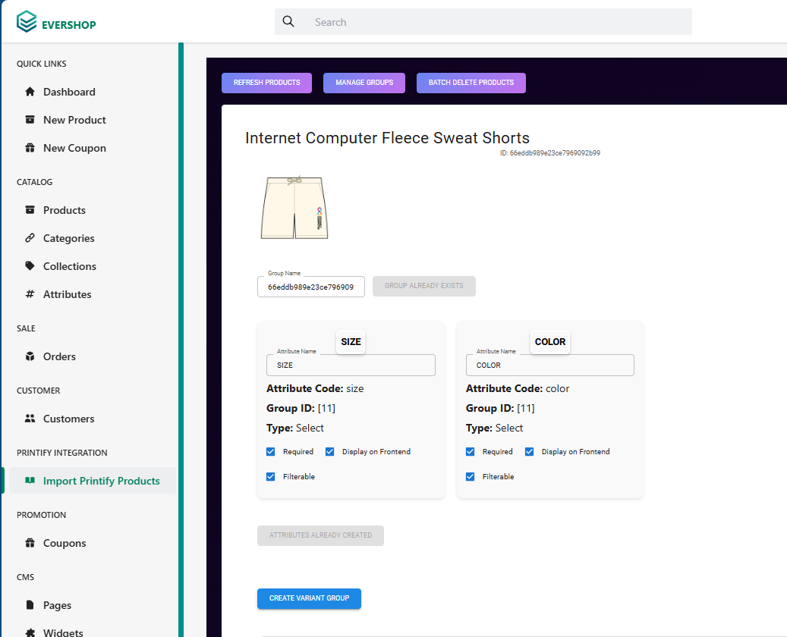
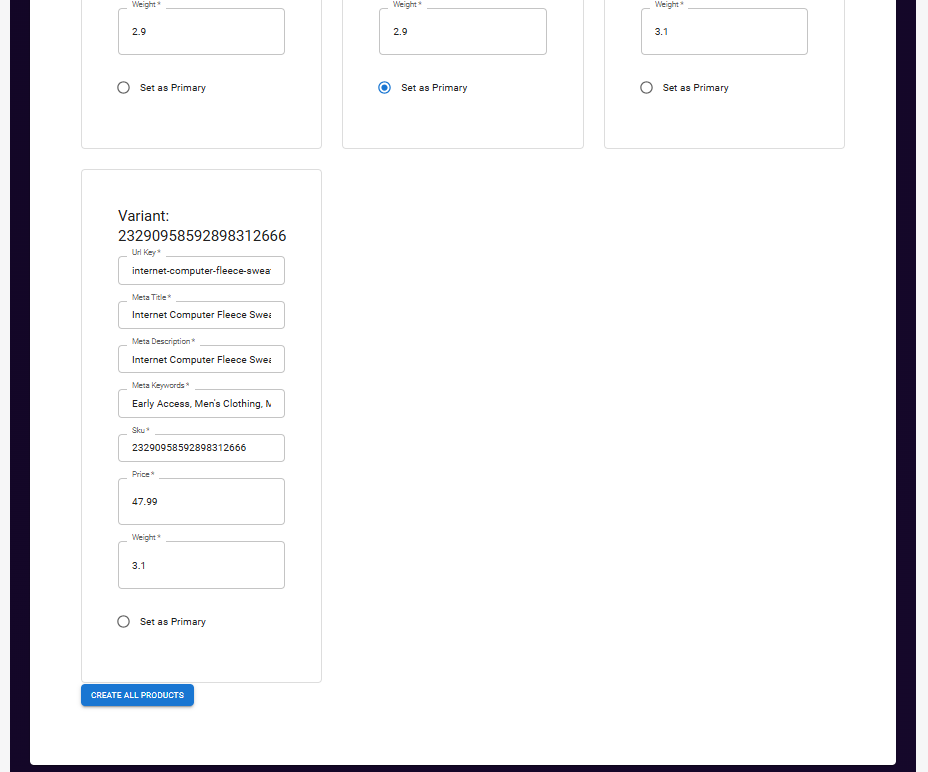
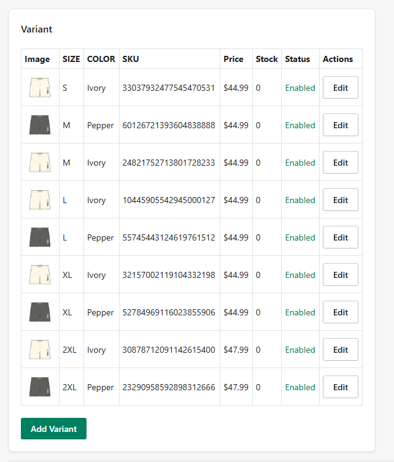
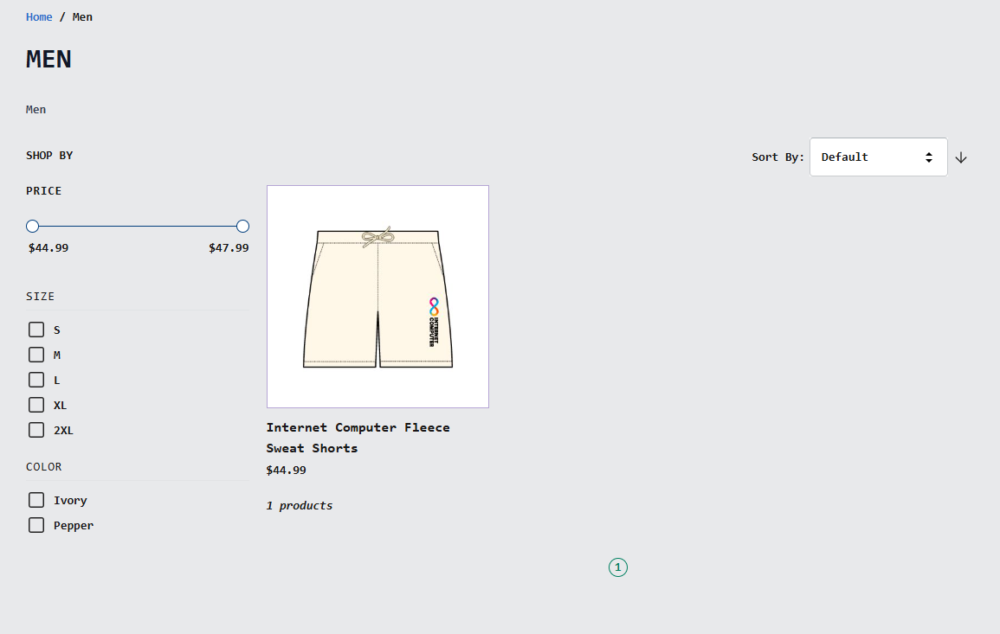
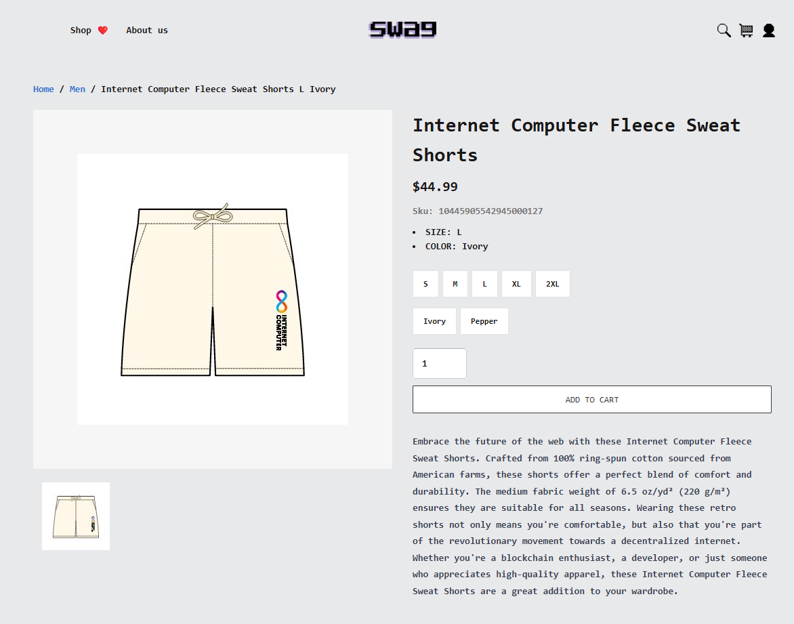

# Printify Integration for EverShop

An integration between EverShop and Printify that streamlines product management through automated imports.

## Screenshots







## Configuration

Configure your `.env`:

```env
PRINTIFY_API_KEY=your_api_key_here
PRINTIFY_SHOP_ID=your_shop_id_here
```

## Core Features

- Automated product import from Printify with proper attribute extraction
- Variant group creation for like products
- Real-time order synchronization with Printify
- Product variant and inventory sync
- Bulk product management tool
- Attribute group creation and deletion interface

## Requirements

- EverShop ^1.0.0
- Node.js ≥ 16
- Valid Printify API credentials

## License

GNU GENERAL PUBLIC LICENSE 3.0
